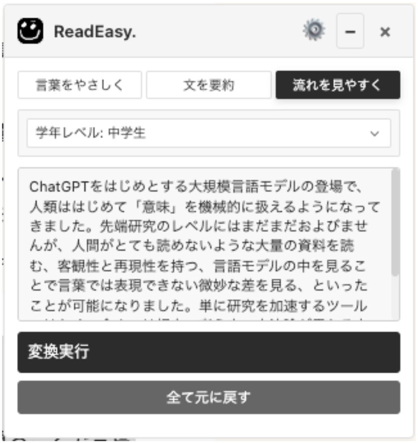
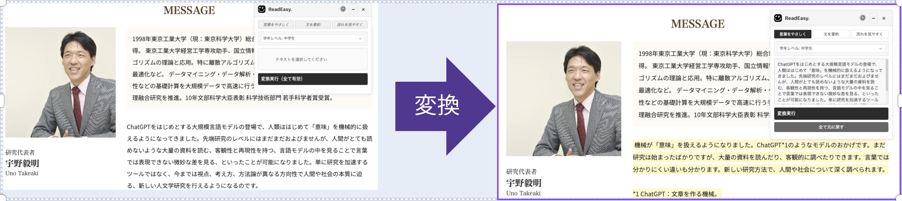
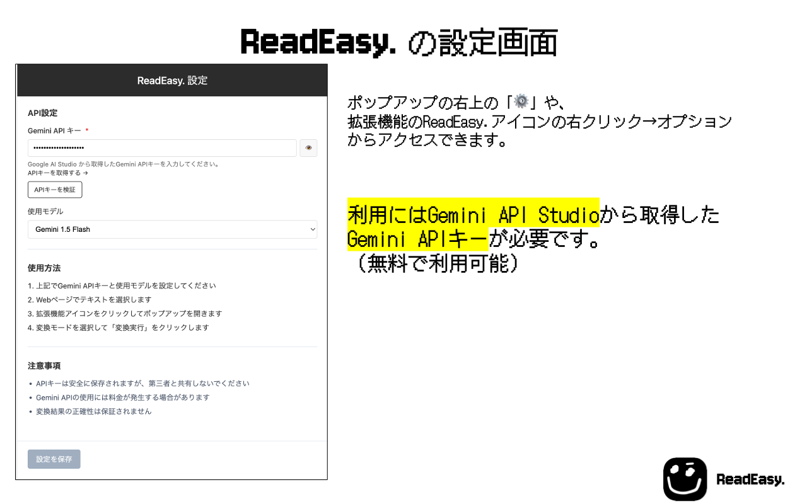

**Webページの文章をAIで読みやすく変換するChrome拡張機能**

## ✨ 特徴

ReadEasy.は、Webページ上の文章をAI（Google Gemini）で読みやすく変換するChrome拡張機能です。学習支援を目的として開発しました。

### 🎯 3つの変換モード

| モード | 説明 | 例 |
|--------|------|-----|
| **言葉をやさしく** | 難しい専門用語や記号に注釈を追加 | `API` → `API（アプリケーション・プログラミング・インターフェース）` |
| **文を要約** | 長い文章を簡潔に要約し、要点を明確化 | 複雑な段落 → 要点を先頭に配置した簡潔な文章 |
| **流れを見やすく** | 論理的な接続詞を追加し、文章の流れを改善 | 断片的な文章 → 接続詞で論理的に繋がった文章 |

### 📚 学年レベル対応

- **幼稚園児** から **専門家レベル** まで7段階で調整可能
- 文の長さや語彙レベルを自動調整
- やさしい日本語ガイドラインに準拠

## 🚀 使い方

### 1. インストール

1. 画面右上にある緑色のボタン[<>Code]をクリックし、表示されるDownload ZIPをクリックしてください
2. 拡張機能が入ったzipファイルがダウンロードされますから、任意の場所に解凍(展開)してください
3. それ以降の手順は以下のサイトを参考にしてください: <https://note.com/cute_echium873/n/n997dcf40b3a1>

### 2. 初期設定

1. [Google AI Studio](https://aistudio.google.com/app/apikey) でGemini APIキーを取得
2. 拡張機能の設定画面でAPIキーを入力
3. 使用するモデルを選択（Gemini 1.5 Flash推奨）

### 3. 使用手順

1. Webページでテキストを選択
2. 拡張機能アイコンをクリックしてポップアップを開く
3. 変換モードと学年レベルを選択
4. 「変換実行」をクリック
5. 結果を確認（ダブルクリックで元に戻す）

## 🎨 スクリーンショット

### フローティングポップアップ

### 変換結果の例

### 設定画面

## ❓ よくある質問

**Q: Gemini APIのキーはどこから取得できますか？無料で取得できますか？**

A: [Google AI Studio](https://aistudio.google.com/app/apikey) から無料で取得できます。Googleアカウントでログイン後、「Create API Key」をクリックして作成してください。無料枠でも十分にご利用いただけます。

**Q: Geminiのモデルはどれが良いですか？**

A: **Gemini 1.5 Flash** が安定して動作します。文章変換がうまくいかない場合は、設定画面でこのモデルに変更してください。

**Q: 変換を元に戻したらページのレイアウトが崩れてしまいました**

A: ページを再リロードしてください。まれにレイアウトが崩れる場合がありますが、リロードで解決します。

**Q: アプリの動作が変です**

A: 以下の手順を試してください：

1. ページをリロード
2. 拡張機能をリロード（拡張機能管理画面で「更新」ボタンをクリック）
3. ブラウザを再起動

**Q: 変換が実行されません**

A: 以下を確認してください：

- APIキーが正しく設定されているか
- インターネット接続が正常か
- 選択したテキストが5文字以上か

**Q: 変換結果が期待通りではありません**

A: 以下の方法を試してください：

- 学年レベルを調整する
- 変換モードを変更する
- より短いテキストで試す

## 🔒 プライバシー

- **データの収集**: ユーザーの設定と変換対象テキストのみ
- **データの保存**: すべてローカル（Chrome拡張機能のストレージ）
- **外部送信**: 変換対象テキストのみGemini APIに送信
- **追跡**: 一切行いません

詳細は [プライバシーポリシー](https://waka320.github.io/read-easy/docs/privacy-policy.html) をご確認ください。

## 🛠️ 技術

- **Manifest V3**
- **Chrome Storage API** による設定管理
- **Google Gemini API** (2.5 Flash/1.5 Flash(推奨)/1.5 Pro)

## 🙏 謝辞

- [日本財団HUMAIプログラム](https://zen.ac.jp/humai) - 本プロジェクトの開発のきっかけ
- [Google Gemini API](https://ai.google.dev/) - AI変換エンジン
- [やさしい日本語ガイドライン](https://www.mhlw.go.jp/stf/seisakunitsuite/bunya/0000081021.html) - 変換基準の参考
- [Chrome Extensions API](https://developer.chrome.com/docs/extensions/) - 拡張機能基盤

---

[⭐ Star this repository](https://github.com/waka320/read-easy) | [wakaport.com](https://wakaport.com)

