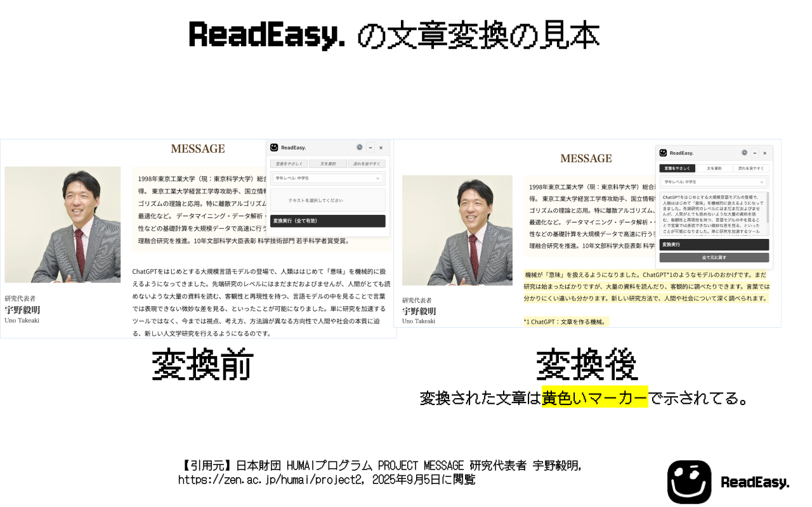

<div align="center">


**Webページの文章をAIで読みやすく変換するChrome拡張機能**

[](https://chrome.google.com/webstore)
[](LICENSE)
[](https://developer.chrome.com/docs/extensions/mv3/)

</div>

## ✨ 特徴

ReadEasy.は、Webページ上の文章をAI（Google Gemini）で読みやすく変換するChrome拡張機能です。学習支援を目的として開発しました。

### 🎯 3つの変換モード

| モード | 説明 | 例 |
|--------|------|-----|
| **言葉をやさしく** | 難しい専門用語や記号に注釈を追加 | `API` → `API（アプリケーション・プログラミング・インターフェース）` |
| **文を要約** | 長い文章を簡潔に要約し、要点を明確化 | 複雑な段落 → 要点を先頭に配置した簡潔な文章 |
| **流れを見やすく** | 論理的な接続詞を追加し、文章の流れを改善 | 断片的な文章 → 接続詞で論理的に繋がった文章 |

### 📚 学年レベル対応

- **幼稚園児** から **専門家レベル** まで7段階で調整可能
- 文の長さや語彙レベルを自動調整
- やさしい日本語ガイドラインに準拠

## 🚀 使い方

### 1. インストール

1. [Chrome Web Store](https://chrome.google.com/webstore) から ReadEasy. をインストール
2. 拡張機能を有効化

### 2. 初期設定

1. [Google AI Studio](https://aistudio.google.com/app/apikey) でGemini APIキーを取得
2. 拡張機能の設定画面でAPIキーを入力
3. 使用するモデルを選択（Gemini 1.5 Flash推奨）

### 3. 使用手順

1. Webページでテキストを選択
2. 拡張機能アイコンをクリックしてポップアップを開く
3. 変換モードと学年レベルを選択
4. 「変換実行」をクリック
5. 結果を確認（ダブルクリックで元に戻す）

## 🎨 スクリーンショット

### フローティングポップアップ


### 変換結果の例



### 設定画面


## 🛠️ 技術仕様

### アーキテクチャ

- **Manifest V3** 対応
- **Service Worker** ベースのバックグラウンド処理
- **ES6 モジュール** によるモジュラー設計
- **Chrome Storage API** による設定管理

### 使用技術

- **Google Gemini API** (2.5 Flash/1.5 Flash/1.5 Pro)
- **Chrome Extensions API**
- **Vanilla JavaScript** (ES6+)
- **CSS3** (フローティングUI)

### ファイル構成

```
read-easy/
├── manifest.json          # 拡張機能の設定
├── js/
│   ├── background.js      # Service Worker
│   ├── content.js         # コンテンツスクリプト
│   ├── floatingUI.js      # フローティングUI
│   ├── geminiClient.js    # Gemini API クライアント
│   ├── promptEngine.js    # プロンプト生成
│   ├── textProcessor.js   # テキスト処理
│   └── options.js         # 設定画面
├── css/                   # スタイルシート
├── html/                  # HTML ファイル
└── icons/                 # アイコン画像
```

## 🔒 プライバシー

- **データの収集**: ユーザーの設定と変換対象テキストのみ
- **データの保存**: すべてローカル（Chrome拡張機能のストレージ）
- **外部送信**: 変換対象テキストのみGemini APIに送信
- **追跡**: 一切行いません

詳細は [プライバシーポリシー](PRIVACY_POLICY.md) をご確認ください。

### 開発環境のセットアップ

1. リポジトリをクローン
2. Chrome の拡張機能管理画面で「デベロッパーモード」を有効化
3. 「パッケージ化されていない拡張機能を読み込む」でプロジェクトフォルダを選択

## 📄 ライセンス

このプロジェクトは [Apache License 2.0](LICENSE) の下で公開されています。

## 🙏 謝辞

- [Google Gemini API](https://ai.google.dev/) - AI変換エンジン
- [やさしい日本語ガイドライン](https://www.mhlw.go.jp/stf/seisakunitsuite/bunya/0000081021.html) - 変換基準
- [Chrome Extensions API](https://developer.chrome.com/docs/extensions/) - 拡張機能基盤

---

<div align="center">

[⭐ Star this repository](https://github.com/waka320/read-easy) | [📖 View Documentation](docs/) | [🐛 Report Bug](https://github.com/waka320/read-easy/issues)

</div>
